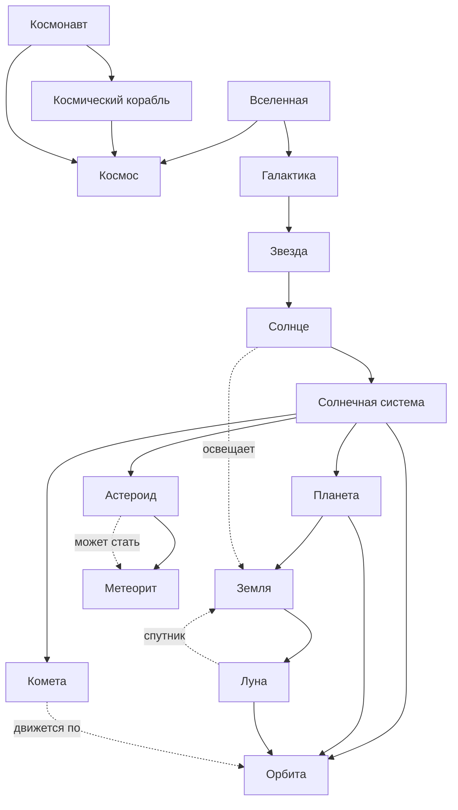

# Раздел детской энциклопедии: Космос

## Участник

| ФИО | Роль в проекте | Оценка |
|---|---|---|
| Елисеев | Разработчик | |

## Цель раздела

Цель работы - подготовить небольшой раздел детской энциклопедии о космосе для читателя примерно 10 лет.

## Использованные источники знаний

Для концептуализации раздела использовались открытые базы знаний:

- Wikidata: сущности `Q634` (планета), `Q523` (звезда), `Q544` (Солнечная система), `Q405` (Луна), `Q525` (Солнце), `Q318` (галактика), `Q3863` (астероид), `Q3559` (комета), `Q40218` (космический корабль).
- DBpedia: статьи и категории о Solar System, Planet, Star, Galaxy, Moon, Comet, Asteroid, Spacecraft.
- Материалы NASA Space Place использовались как ориентир для детского уровня объяснения.

Пример SPARQL-запроса для получения фрагмента знаний из Wikidata сохранен в файле `data/wikidata_space_query.rq`. Он выбирает космические объекты, их типы, русские названия и краткие описания.

## Концептуализация

В предметной области выделены 15 понятий:

1. Космос
2. Вселенная
3. Галактика
4. Звезда
5. Солнце
6. Планета
7. Земля
8. Луна
9. Солнечная система
10. Орбита
11. Комета
12. Астероид
13. Метеорит
14. Космический корабль
15. Космонавт

Эти понятия покрывают три группы знаний: устройство космоса, объекты Солнечной системы и деятельность человека в космосе.

## Онтология

### Основные связи

- `часть-целое`: Солнце входит в Солнечную систему, Земля входит в Солнечную систему, Луна связана с Землей.
- `класс-экземпляр`: Солнце является звездой, Земля является планетой.
- `движение`: планеты, кометы и Луна движутся по орбитам.
- `причина/превращение`: небольшой астероид или его осколок может стать метеоритом, если долетит до поверхности Земли.
- `человек и техника`: космонавт использует космический корабль для работы в космосе.

## Генерация текстов

Markdown-страницы находятся в директории `../../KIDBOOK/space`. Тексты написаны в стиле запроса "объясни для десятилетнего ребенка": короткие абзацы, простые сравнения, аккуратное объяснение терминов.

После подготовки текстов использован скрипт `scripts/add_cross_links.py`, который расставляет перекрестные ссылки между понятиями из `concepts.json`. Скрипт учитывает несколько распространенных форм слов, например `звезды`, `звезду`, `планеты`, `планетах`, `космического корабля`.

## Результаты

- Создана онтология раздела "Космос" из 15 понятий.
- Подготовлен файл `concepts.json` со списком понятий, страниц, Wikidata ID и вариантами написания.
- Созданы 15 markdown-страниц детской энциклопедии.
- Добавлен Python-скрипт для автоматической простановки перекрестных ссылок.
- Страницы уже содержат внутренние ссылки на другие понятия раздела.
